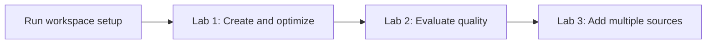
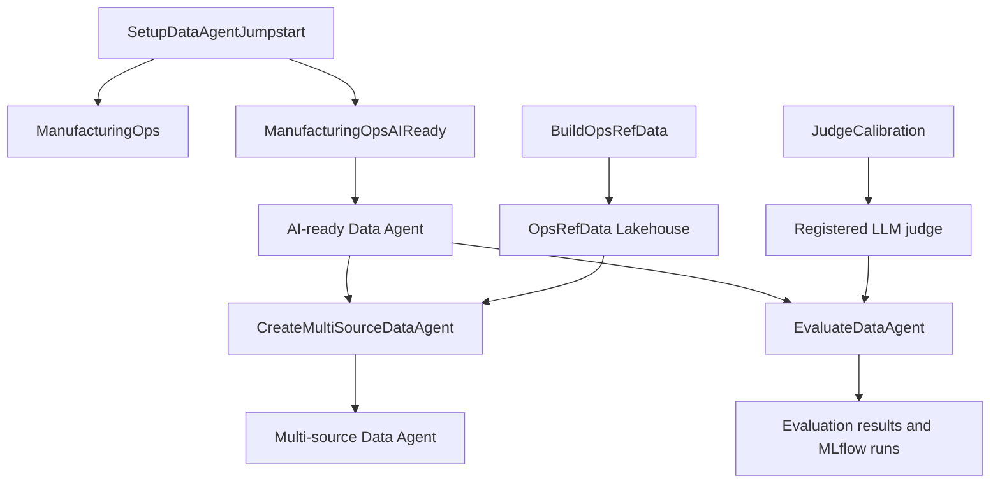

> Curated learning fork maintained by [Mudit Dholakia](https://github.com/muditdholakia). Original authorship: [microsoft/fabric-data-agent-workshop](https://github.com/microsoft/fabric-data-agent-workshop). See [your learning plan](CURATOR_README.md) and [security audit](CURATOR_SECURITY.md). Upstream license and copyright notices are retained.

# Getting Started with Data Agents

Build a governed Microsoft Fabric Data Agent, prepare a semantic model for AI,
extend the agent with a Lakehouse source, and evaluate response quality with a
calibrated LLM judge and MLflow.

This Jumpstart is a guided, hands-on workshop for data and analytics
practitioners who want to move beyond creating a basic Data Agent and learn how
to make one accurate, explainable, and measurable.

## Learning objectives

By completing the workshop, you will learn how to:

1. Create a Fabric Data Agent over a Power BI semantic model.
2. Diagnose response quality by inspecting generated DAX, run steps, latency,
   and answers.
3. Prepare a semantic model for AI with business-friendly metadata, an AI data
   schema, verified answers, and AI instructions.
4. Add a Lakehouse as a second source and publish a multi-source Data Agent with
   the Python SDK.
5. Calibrate an LLM-as-Judge, run repeatable evaluations, and track results in
   MLflow.

## Workshop journey



| Lab | What you will do | Starting items | What you will create |
| --- | --- | --- | --- |
| **Setup - Prepare the workspace** | Import, organize, and validate the populated workshop assets. | `SetupDataAgentJumpstart` | Baseline and AI-ready semantic models and reports |
| **Lab 1 - Create and optimize Data Agents** | Create a Data Agent, inspect its answers and DAX, compare baseline and AI-ready models, configure Prep data for AI and agent instructions, compare runtimes, and use Code Interpreter. | `ManufacturingOps` and `ManufacturingOpsAIReady` models and reports | A baseline Data Agent and an optimized AI-ready Data Agent |
| **Lab 2 - Evaluate Data Agents** | Calibrate an LLM judge, run a fixed evaluation set, and inspect quality, latency, reasoning, and MLflow results. | Your optimized Data Agent, `JudgeCalibration`, and `EvaluateDataAgent` | An evaluation Lakehouse, MLflow experiment, registered judge, and evaluation runs |
| **Lab 3 - Add multiple data sources** | Build a Lakehouse source, add it with the SDK, publish a multi-source agent, and refine its configuration with Build agent with AI. | Your optimized Data Agent, `BuildOpsRefData`, and `CreateMultiSourceDataAgent` | `OpsRefData` Lakehouse and a Data Agent whose name ends in `_MultiSource` |

## What the Jumpstart installs

The Jumpstart initially installs six Python notebooks into the
`getting-started-data-agents` workspace folder:

| Notebook | Purpose |
| --- | --- |
| `SetupDataAgentJumpstart` | Required entry point. Imports and validates the populated semantic models and reports. |
| `RefreshSemanticModel` | Optional maintenance for refreshing or repairing the semantic model Web connection. |
| `BuildOpsRefData` | Creates the schema-enabled `OpsRefData` Lakehouse and its supported Data Agent views. |
| `CreateMultiSourceDataAgent` | Copies the base agent configuration, adds the Lakehouse source, and publishes a multi-source agent. |
| `JudgeCalibration` | Calibrates and registers the LLM judge used by the evaluation workflow. |
| `EvaluateDataAgent` | Evaluates Data Agent responses and records results in MLflow. |

During the required setup step, `SetupDataAgentJumpstart` also imports:

| Item | Type | Purpose |
| --- | --- | --- |
| `ManufacturingOps` | Semantic model and report | Baseline experience used to identify common AI-readiness issues. |
| `ManufacturingOpsAIReady` | Semantic model and report | Optimized experience used to build the governed Data Agent. |

## Prerequisites

- A paid Microsoft Fabric F2 capacity or higher, or an eligible Power BI
  Premium capacity with Fabric enabled.
- Power BI Pro.
- Contributor or higher access to the target Fabric workspace.
- Fabric tenant settings required for Copilot and Data Agents.
- Permission to create Fabric items, connections, and Data Agents.
- Familiarity with Power BI, DAX, Python, and SQL is helpful.

## Install from the Jumpstart catalog

Once the Jumpstart registration is published, run this in a Fabric notebook:

```python
%pip install -q fabric-jumpstart

import fabric_jumpstart as jumpstart

jumpstart.install("getting-started-data-agents")
```

When run inside Fabric, the current workspace is detected automatically. To
install into another workspace, pass its ID:

```python
jumpstart.install(
    "getting-started-data-agents",
    workspace_id="<workspace-id>",
)
```

The underscored `_install_from_github()` API is only for source development and
pre-publication testing. Participants should use `jumpstart.install()`.

## Start the workshop

1. Open the installed `SetupDataAgentJumpstart` notebook.
2. Select **Run all without changing any values**.
3. Wait for the final success message confirming that both PBIX assets were
   imported, moved into the Jumpstart folder, pointed to the Microsoft-hosted
   data source, and validated.
4. Open the [workshop lab
   instructions](https://github.com/microsoft/fabric-data-agent-workshop/tree/main/documentation/lab-instructions).
5. Complete Labs 1–3 in order.

The imported PBIX files already contain populated cached data, so
`RefreshSemanticModel` is not required for the initial workshop.

## How the solution fits together



## Repository layout

| Path | Contents |
| --- | --- |
| `getting-started-data-agents/` | Fabric item definitions. The catalog installation deploys the six notebooks. |
| `assets/pbix/` | Populated PBIX files imported by the setup notebook. |
| `documentation/lab-instructions/` | Workshop PDF and Markdown instructions. |
| `data/` | Manufacturing operations source data. |
| `eval/` | Evaluation and judge-calibration workbooks. |
| `instructor-tools/` | Optional utilities for workshop facilitators. |
| `tools/` | Deterministic source-generation utilities and templates. |

## Fabric Data Agent resources

| Resource | Description |
| --- | --- |
| [Semantic model best practices](https://learn.microsoft.com/en-us/fabric/data-science/data-agent-configuration-best-practices) | Microsoft guidance for configuring semantic models for Fabric data agents. |
| [Instructions Please](https://pawarbi.github.io/instructions-please/) | Interactive game for learning where Fabric Data Agent instructions belong. |
| [Data Agent Inspector](https://data-agent-inspector.streamlit.app/) | Inspect and understand Fabric data agent behavior. |
| [Fabric Data Agent Hub](https://fabricdatagent.com/) | Central hub for Fabric data agent resources. |
| [RANCH](https://data-agent-ranch.streamlit.app/) | Migrate implementations from the Assistants API to the Responses API. |
| [HALO](https://github.com/pawarbi/data-agent-halo) | Fabric data agent tooling and resources. |
| [AXIS](https://pawarbi-axis-fabric-data-agent.hf.space/) | Fabric data agent experience hosted on Hugging Face Spaces. |

## Contributing

This project welcomes contributions and suggestions. Most contributions require
you to agree to a Contributor License Agreement (CLA) declaring that you have
the right to, and actually do, grant us the rights to use your contribution.
For details, visit [Microsoft Contributor License
Agreements](https://cla.opensource.microsoft.com).

When you submit a pull request, a CLA bot will automatically determine whether
you need to provide a CLA and decorate the pull request appropriately. You only
need to complete this process once across Microsoft repositories.

This project has adopted the [Microsoft Open Source Code of
Conduct](https://opensource.microsoft.com/codeofconduct/). For more information,
see the [Code of Conduct
FAQ](https://opensource.microsoft.com/codeofconduct/faq/) or contact
[opencode@microsoft.com](mailto:opencode@microsoft.com).

## Trademarks

This project may contain trademarks or logos for projects, products, or
services. Authorized use of Microsoft trademarks or logos is subject to
Microsoft's [Trademark and Brand
Guidelines](https://www.microsoft.com/legal/intellectualproperty/trademarks/usage/general).
Use in modified versions must not cause confusion or imply Microsoft
sponsorship. Third-party trademarks and logos remain subject to their respective
policies.
